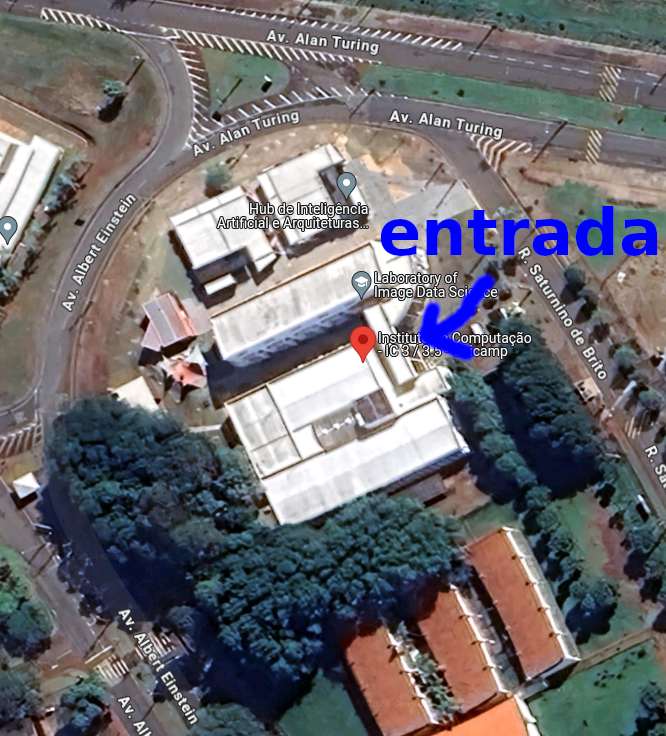

## Local e Horários

As aulas serão terças e quintas das 8h às 10h no Instituto de Computação, prédio IC 3/3.5, sala 351.

### Como chegar no local

O Instituto de Computação possui mais de um prédio. O IC 3/3.5 fica logo no início da rua Saturnino de Brito (veja imagem abaixo).

Este é o endereço no [Google Maps](https://maps.app.goo.gl/uhgVRw3zTV51Z7Mm8).

A entrada do prédio é indicada na foto a seguir (dentro do prédio a sala é identificada como 51):

## Cronograma de Aulas

O calendário de aulas da Unicamp inicia 28/02. Entretanto, como esta disciplina abrange alunos de cursos diferentes, além de alunos que entrarão na alteração de matrícula, a aula de abertura oficial da disciplina será na quinta-feira (07/03). Antes disso será oferecido um material de alinhamento e aquecimento tanto no [Google Classroom](https://classroom.google.com/c/NjU2Njk1MDEwNDUx) quanto na página de [Primeiros Passos](start.md). 

No dia 29/02 às 8am o professor André estará disponível na sala 351 para aqueles alunos que queiram tirar dúvidas sobre a disciplina. Mesmo aqueles que ainda não estão matriculados e queiram entrar na alteração de matrícula ou querem se candidatar para participar como ouvintes.

## Acesso ao Google Classroom

Alunos especiais e aqueles que ingressarem na alteração de matrícula levarão alguns dias após o início das aulas para terem acesso ao Google Classroom. Não se preocupe, até que você tenha acesso, você poderá acompanhar a disciplina pela página de [Primeiros Passos](start.md).

## Endereços Importantes

* [Página Principal da Disciplina](/)
* [Google Classroom da Disciplina](https://classroom.google.com/c/NjU2Njk1MDEwNDUx)
* [FAQ](faq.md)

## Página de Orientações Iniciais

Esta página e a de [Primeiros Passos](start.md) servem para orientações iniciais. Todos devem buscar o quanto antes o acesso ao Google Classroom para acompanhar o restante da disciplina.
