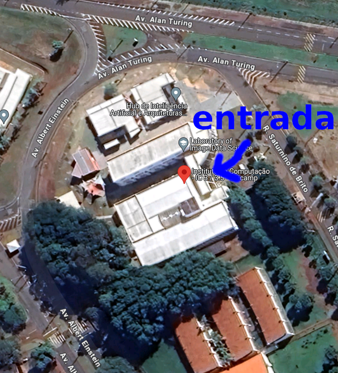

## Local e Horários

As aulas serão segundas e quartas das 14h às 16h.
no Instituto de Computação, prédio IC 3/3.5, sala 352.

### Como chegar no local

O Instituto de Computação possui mais de um prédio. O IC 3/3.5 fica logo no início da rua Saturnino de Brito (veja imagem abaixo).

Este é o endereço no [Google Maps](https://maps.app.goo.gl/uhgVRw3zTV51Z7Mm8).

A entrada do prédio é indicada na foto a seguir:

## Acesso ao Google Classroom

Alunos estão alocados em diferentes turmas do Google Classroom e alguns receberão convites para ingressar na turma que concentra todos. 
Alunos especiais e aqueles que ingressarem na alteração de matrícula levarão alguns dias após o início das aulas para terem acesso ao Google Classroom.

## Endereços Importantes

* [Página Principal da Disciplina](/)
* [Google Classroom da Disciplina](https://classroom.google.com/c/ODQwMTg4NTgxMDMz)
* [FAQ](faq.md)

<!--
## Página de Orientações Iniciais

Esta página e a de [Primeiros Passos](start.md) servem para orientações iniciais. Todos devem buscar o quanto antes o acesso ao Google Classroom para acompanhar o restante da disciplina.
-->