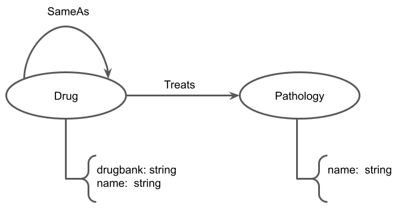

# P1 - Template da Primeira Entrega
*2024.1 Ciência e Visualização de Dados em Saúde*

# Estrutura de sua pasta de projeto

A fim de uniformizar os repositórios de projetos da disciplina, os diretórios de seu repositório deverão ser nomeados conforme segue.

Seu repositório deverá obrigatoriamente conter o arquivo `README.md`, arquivo de documentação Markdown, que deverá conter a descrição do projeto conforme orientações a seguir.

~~~
...
│
└── project1
    |
    ├── README.md   <- texto da Entrega 1 do projeto
    |
    └── assets      <- mídias usadas no projeto
        ├── images  <- imagens usadas no texto do README.md
        └── slides  <- slides da prévia (em PDF)
~~~

Na raiz da pasta `project1` deve haver um arquivo de nome `README.md` contendo a apresentação do projeto, como detalhado na seção seguinte.

Segue abaixo o modelo de como deve ser apresentado e documentado o projeto. Há partes do modelo a seguir que têm uma marcação específica indicando que **não devem ser literalmente transcritas**:

Trecho entre `<...>` representa algo que deve ser substituído pelo indicado. Nesse caso, você não deve manter os símbolos `<...>`.
> Parágrafo que aparece neste modo de citação representa algo que deve ser substituído pelo explicado.

No modelo a seguir são colocados exemplos ilustrativos, que serão substituídos pelos do seu projeto.

> # Modelo para Apresentação da Entrega 1 do Projeto (Arquivo README.md)

# Projeto `<Título em Português>`
# Project `<Title in English>`

# Descrição Resumida do Projeto

> Descrição do tema do projeto, incluindo motivação e contexto gerador.

# Fundamentação Teórica

> Fundamentação teórica resumida do problema em saúde/biologia. Apenas cite artigos que tomará como base e, em uma frase, em que problema.

# Perguntas de Pesquisa

> Perguntas de pesquisa que o projeto pretende responder ou hipóteses a serem avaliadas, enunciadas de maneira objetiva e verificável.

# Bases de Dados

> Elencar bases de dados candidatas a serem utilizadas no projeto na forma de tabela:

> Base de Dados | Endereço na Web | Resumo descritivo
> ----- | ----- | -----
> Título da Base 1 | http://base1.org/ | Breve resumo (duas ou três linhas) sobre a base.
> Título da Base 2 | http://base2.org/ | Breve resumo (duas ou três linhas) sobre a base.

# Modelo Lógico

> Modelo lógico da base de grafos que será construída. Para o modelo de grafos de propriedades, utilize este
> [modelo de base](https://docs.google.com/presentation/d/10RN7bDKUka_Ro2_41WyEE76Wxm4AioiJOrsh6BRY3Kk/edit?usp=sharing) para construir o seu.
> Coloque a imagem do PNG do seu modelo lógico como ilustrado abaixo (a imagem estará na pasta `image`):
>
> 

# Metodologia
> Esta seção evoluirá ao longo do projeto. Nesta primeira entrega, informe técnicas de Ciência de Redes que pretende explorar,
> tais como: detecção de comunidades, análise de centralidade, predição de links, ou a combinação de uma ou mais técnicas. Descreva o que perguntas pretende endereçar cm a técnica escolhida.

# Ferramentas

> Ferramentas a serem utilizadas (com base na visão atual do grupo sobre o projeto).

# Referências Bibliográficas

> Lista de artigos, links e referências bibliográficas.
>
> Fiquem à vontade para escolher o padrão de referenciamento preferido pelo grupo.